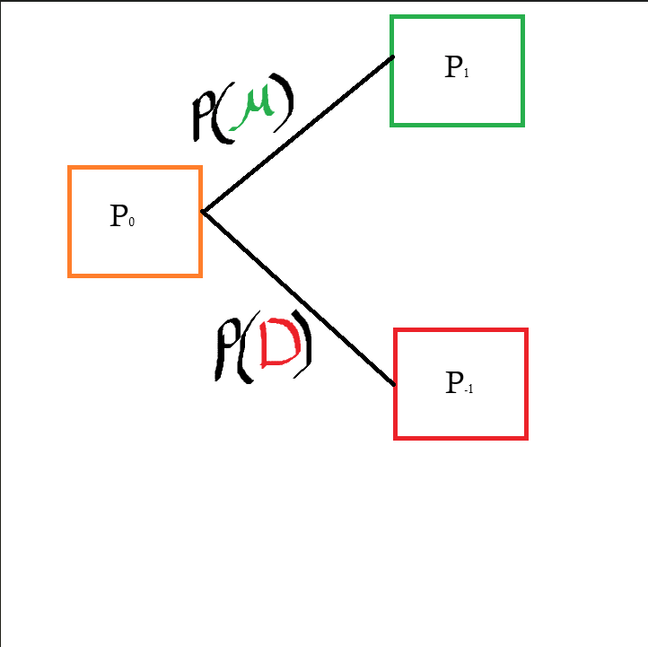

### Binomial Model Theory Overview

**Disclaimer**: Many regulatory bodies, including the European Securities and Markets Authority (ESMA) and the U.S. Federal Bureau of Investigation (FBI), have issued warnings or outright banned retail binary options trading due to widespread fraud. Most platforms are unregulated, and the business model often pits the trader against the broker, making it mathematically designed for traders to lose money. Binary options are often described as a form of gambling rather than a legitimate investment. 

**This is only for educational purposes, this is NOT financial advice**

## 5 Key Components

1. Beginning Asset Value
    --> The initial value of the underlying asset

2. Size of the **up** move
    --> The expected gain given that the underlying asset has increased in value
    --> Denotated as U

3. Size the **down** move
    --> The expected loss given that the underlying asset has decreased in value
    --> Denotated as D (= 1/U)

4. Probability of the **up** move
    --> Chances that the underlying asset increases in value
    --> Denotated as P(U)

5. Probability of the **down** move
    --> Chances that the underlying asset decreases in value
    --> Denotated as P(D) (= 1 - P(D))

## First Step: Forward Binary Options Pricing Tree
Given that binary options follow binomial distrubution behavior, a binary tree data structure would be the best data structure to capture the behavior. 

#### Visual Demonstration
Here is a sample of forward binary options pricing tree with the following parameters: iterations = 2, Upside & Downside  = 10% 

        ┌── 81.00
    ┌── 90.00
    │   └── 99.00
    100.00
    │   ┌── 99.00
    └── 110.00
        └── 121.00

    